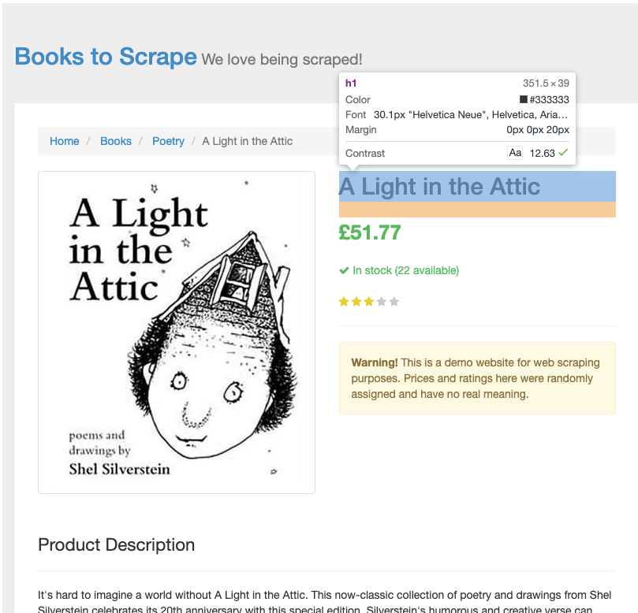
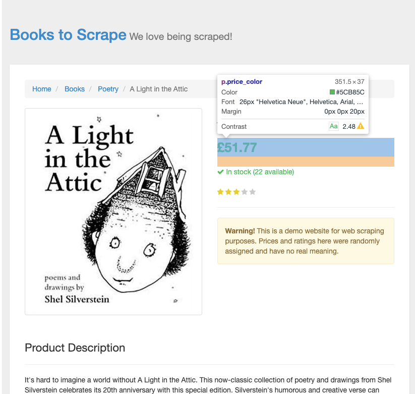
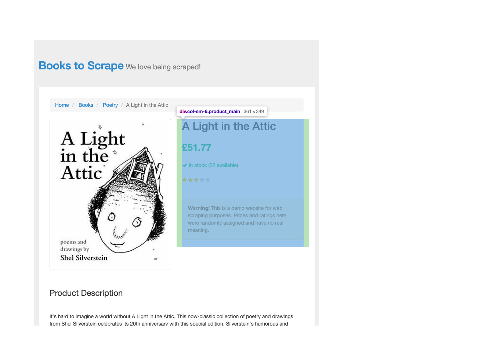

スクレイピングに興味があったので、[PythonによるWebスクレイピング 第2版 \| Ryan Mitchell, 嶋田 健志, 黒川 利明 \|本 \| 通販 \| Amazon](https://www.amazon.co.jp/Python%E3%81%AB%E3%82%88%E3%82%8BWeb%E3%82%B9%E3%82%AF%E3%83%AC%E3%82%A4%E3%83%94%E3%83%B3%E3%82%B0-%E7%AC%AC2%E7%89%88-Ryan-Mitchell/dp/4873118719)を読んでいる。

GithubでJupyter notebooksが公開されていて（[REMitchell/python\-scraping: Code samples from the book Web Scraping with Python](https://github.com/REMitchell/python-scraping)）、実際にコードを動かしながら読めるのでわかりやすい。3章までに読んだ内容を元に、スクレイピングの練習をしてみる。

## 架空のオンライン書店のスクレイピング

スクレイピングの対象は以下のサイトにした。

- [All products \| Books to Scrape \- Sandbox](http://books.toscrape.com/)

スクレイピングの学習者向けに公開されているサイトで、架空のオンライン書店の形をしている。自由にスクレイピングしていいらしいので、とてもありがたい。

今回は、このオンライン書店内にある全ての本のタイトルと価格を抽出して表示するプログラムを作る。

### ページ内のリンクを再帰的に取得する

以下のコードは、http://books.toscrape.com/ を起点として、ページ内のリンクを再帰的に辿って表示する。

```python
from urllib.request import urlopen
from bs4 import BeautifulSoup
import re
from urllib.parse import urljoin


# すでに訪れたページのリスト
visitedPages = set()


def getLinks(pageUrl):
    global visitedPages

    html = urlopen(pageUrl)
    bs = BeautifulSoup(html, 'html.parser')

    print(pageUrl)

    for link in bs.find_all('a'):
        if 'href' in link.attrs:
            newPage = urljoin(pageUrl, link.attrs['href'])

            if newPage not in visitedPages:
                visitedPages.add(newPage)
                getLinks(newPage)


getLinks('http://books.toscrape.com/')

```

実行するとサイト内のすべてのページのURLが出力される。

これだけのコード量でサイト内のページをすべて取得できるのだから、再帰というものは魔法みたいだと思う。

```bash
$ python3 book-crawler.py
http://books.toscrape.com/
http://books.toscrape.com/index.html
http://books.toscrape.com/catalogue/category/books_1/index.html
http://books.toscrape.com/catalogue/category/books/travel_2/index.html
http://books.toscrape.com/catalogue/category/books/mystery_3/index.html
http://books.toscrape.com/catalogue/category/books/historical-fiction_4/index.html
http://books.toscrape.com/catalogue/category/books/sequential-art_5/index.html
http://books.toscrape.com/catalogue/category/books/classics_6/index.html
http://books.toscrape.com/catalogue/category/books/philosophy_7/index.html
http://books.toscrape.com/catalogue/category/books/romance_8/index.html
http://books.toscrape.com/catalogue/category/books/womens-fiction_9/index.html
〜〜以下省略〜〜

```

基本的には 『PythonによるWebスクレイピング』の[第3章のコード例](https://github.com/REMitchell/python-scraping/blob/master/Chapter03-web-crawlers.ipynb) とそれほど変わらないが、いくつか変えたところもある。以下で説明する。


### 相対URLを絶対URLに変換する

『PythonによるWebスクレイピング』ではWikipediaの英語版をスクレイピングの対象としていて、内部リンクがすべて `/wiki/` から始まる相対URLとなっているため、絶対URLをもとめるのが簡単になっていた（`https://en.wikipedia.org` とその相対URLを結合するだけで絶対URLになる）。

一方、http://books.toscrape.com/ では、

```html
<a href="../../../../index.html">Home</a>
```

のようなダブルドット（`..`）を使った相対URLが使われているため、単純な文字列の結合だけでは絶対URLを得ることができない。

幸い、PythonにはURLを解析していい感じに分解したり結合したりできる `urllib.parse.urljoin` という標準ライブラリが用意されている
（[urllib\.parse \-\-\- URL を解析して構成要素にする — Python 3\.8\.5 ドキュメント](https://docs.python.org/ja/3/library/urllib.parse.html#module-urllib.parse)）。

使い方は簡単で、以下のように、第一引数に自分がいま見ているページの絶対URLを、第二引数にそのページからの相対URLを渡すと、相対URLを絶対URLにして返してくれる。

```python 

>>> from urllib.parse import urljoin
>>> urljoin('http://books.toscrape.com/catalogue/category/books/travel_2/index.html', '../../../../index.html')
'http://books.toscrape.com/index.html'
```

コードの以下の部分でページ内のリンクを絶対URLに変換するのに使った。

```python 
newPage = urljoin(pageUrl, link.attrs['href'])
```

### 本の情報を抽出する

単にURLを出力するだけではおもしろくないので、本のタイトルと価格を表示してみる。

#### 商品ページの特徴

本の情報を抽出するためには、いま見ているページが商品のページなのか、それともトップページ（[All products \| Books to Scrape \- Sandbox](http://books.toscrape.com/index.html)）やカテゴリごとのページ（[Poetry \| Books to Scrape \- Sandbox](http://books.toscrape.com/catalogue/category/books/poetry_23/index.html)）など商品の一覧のページなのか区別する必要がある。商品のページのときだけ本の情報を抽出したい。

URLに商品ページに固有の特徴を見つけられなかったので、ページの内容に特徴を探すことにした。

適当な商品のページ（[A Light in the Attic \| Books to Scrape \- Sandbox](http://books.toscrape.com/catalogue/a-light-in-the-attic_1000/index.html)）のソースを観察してみると、商品のページでは、

```html
<article class="product_page">
```

のように `<article>` タグに商品ページであることを示すクラス属性 `product_page` が付与されていることがわかった。

このタグは以下のようにCSSセレクタを使って取得できるから、その結果から商品ページかどうか判断できる。

```python
bs.select(".product_page")
```

#### タイトルの取得

次に商品ページから本のタイトルを取得する。

ブラウザの開発者ツールを使って本のタイトル部分の要素を選択すると、タイトルは単純に `h1` タグの中にあることがわかる。



したがって、タイトルは以下のように取得できる。 

```python
title = bs.h1.get_text()
```

#### 本の価格

本の価格の場合はすこし面倒で、タイトルと同様に要素を調べると、`<p class="price_color">£51.77</p>` のように `price_color` というクラス属性が付与されているのが価格だとわかる。



ただし、本によっては他の本の情報を下の方に表示しているものがあるため（例えば[The Black Maria \| Books to Scrape \- Sandbox](http://books.toscrape.com/catalogue/the-black-maria_991/index.html)）、ページの上の方に載っているメインの商品の価格のみを取得できるようにしたい。開発者ツールを使ってメインの商品の情報の部分を選択すると、`product_main` というクラス属性が付与された `div` タグで囲まれていることがわかる。



したがって、本の価格は以下のように取得できる。

```python
price = bs.select_one(".product_main>.price_color").get_text()
```


### 最終的なコード

以上を組み合わせて、最終的なコードは以下のようになった。

```python
from urllib.request import urlopen
from bs4 import BeautifulSoup
import re
from urllib.parse import urljoin


# すでに訪れたページのリスト
visitedPages = set()


def getLinks(pageUrl):
    """
    ページ内のリンクを再帰的に辿って、タイトルと価格およびURLを表示する

    Parameters
    ----------
    pageUrl : str
        スクレイピングするページのURL

    """
    global visitedPages

    html = urlopen(pageUrl)
    bs = BeautifulSoup(html, 'html.parser')

    try:
        if bs.select(".product_page"):
            title = bs.h1.get_text()
            price = bs.select_one(".product_main>.price_color").get_text()
            print("{}, {}, {}".format(title, price, pageUrl))
    except AttributeError:
        pass

    for link in bs.find_all('a'):
        if 'href' in link.attrs:
            newPage = urljoin(pageUrl, link.attrs['href'])

            if newPage not in visitedPages:
                visitedPages.add(newPage)
                getLinks(newPage)


getLinks('http://books.toscrape.com/')
```

実行すると、すべての本のタイトル、価格、商品のページのURLが出力された。

```
$ python3 book-crawler2.py
The Long Shadow of Small Ghosts: Murder and Memory in an American City, £10.97, http://books.toscrape.com/catalogue/the-long-shadow-of-small-ghosts-murder-and-memory-in-an-american-city_848/index.html
Dark Notes, £19.19, http://books.toscrape.com/catalogue/dark-notes_800/index.html
Amid the Chaos, £36.58, http://books.toscrape.com/catalogue/amid-the-chaos_788/index.html
Chasing Heaven: What Dying Taught Me About Living, £37.80, http://books.toscrape.com/catalogue/chasing-heaven-what-dying-taught-me-about-living_797/index.html
The Activist's Tao Te Ching: Ancient Advice for a Modern Revolution, £32.24, http://books.toscrape.com/catalogue/the-activists-tao-te-ching-ancient-advice-for-a-modern-revolution_928/index.html
The Four Agreements: A Practical Guide to Personal Freedom, £17.66, http://books.toscrape.com/catalogue/the-four-agreements-a-practical-guide-to-personal-freedom_970/index.html
We Are All Completely Beside Ourselves, £24.04, http://books.toscrape.com/catalogue/we-are-all-completely-beside-ourselves_301/index.html
〜〜以下省略〜〜

```

## まとめ

『[PythonによるWebスクレイピング](https://www.amazon.co.jp/Python%E3%81%AB%E3%82%88%E3%82%8BWeb%E3%82%B9%E3%82%AF%E3%83%AC%E3%82%A4%E3%83%94%E3%83%B3%E3%82%B0-%E7%AC%AC2%E7%89%88-Ryan-Mitchell/dp/4873118719)』の第3章までで学んだ内容を元に、架空のオンライン書店から本の情報をスクレイピングする練習をしてみた。

コードを汎用的にしたり、集めたデータをDBに蓄積したりするのは、もっと後の章をよんでから。
